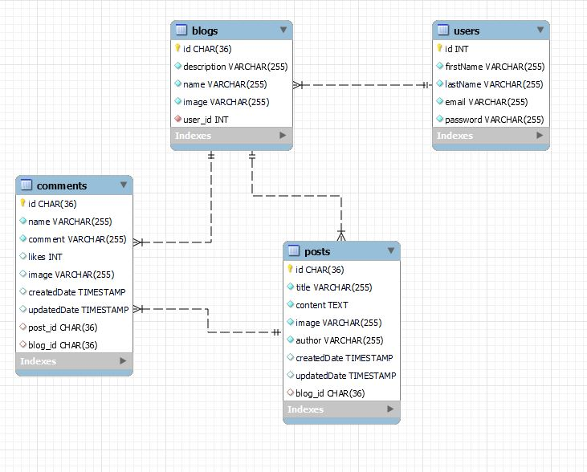

# Capstone Project--WriteMe.Blog
### Fork and Configure Project
- In Terminal, navigate to your Brainstation directory
- Fork this repo
- Once you have forked the above repo, git clone <clonedrepourl>
- cd into the project directory
- cd client && npm i
- cd ..
- cd server && npm i
- cp .env.sample .env
- In your .env file, add a value for your JWT_SECRET env variable, choose any value.

### Database Configuration, Migration, and Seeding
- In server/knexfile.js, ensure your database configuration contains valid values. A sample is shown below.

```js
module.exports = {
  development: {
    client: "mysql",
    connection: {
      host: "127.0.0.1",
      user: "root",
      password: "rootroot",
      database: "connecting",
      charset: "utf8",
    },
  },
};
```
### Update any configuration variables (user, password, etc) to credentials that you use to access MySQL
- In Terminal, cd server
- In Terminal, type mysql -u root -p to login as root user.
- In the mysql console, type: CREATE DATABASE connecting;
- In the mysql console, type: exit
- In Terminal, run npm run migrate from the /server directory
- In Terminal, run npm run seed from the /server directory

### ERD

